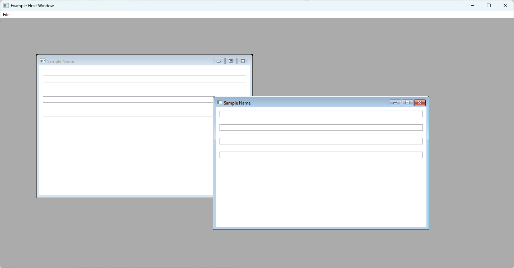
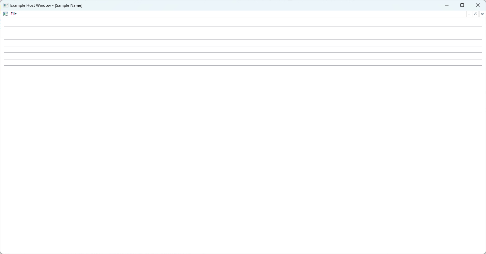
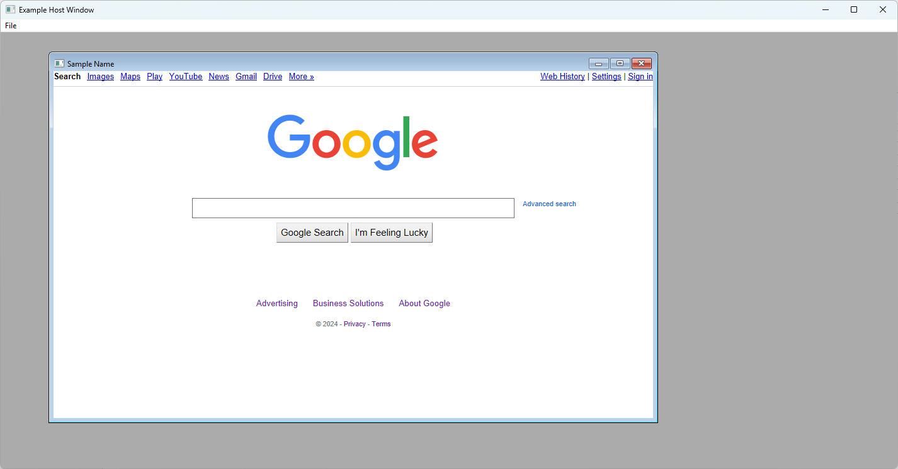

# WpfMdiChildSample

Demonstration of using `HwndWrapper.AddHookLast` to call `DefMDIChildProcW` from WPF.

## Notable steps

1. Have a native MDI frame's HWND on the same thread as a WPF dispatcher **Note:** This would not be expected to work with Winforms MDI Frame, since it expects its children to be `Form`s
1. Create an `HwndSource` and specify `WS_EX_MDICHILD` and the `MDIClient` as the parent window
1. Call `AddHookLast` to intercept calls to `DefWindowProc` and call `DefMDIChildProcW`

See [WpfMdiClientWindow/MdiChildWindow.cs](WpfMdiClientWindow/MdiChildWindow.cs) 
and [WpfMdiClientWindow/HwndSourceHacks.cs](WpfMdiClientWindow/HwndSourceHacks.cs) for most of the magic.

## Related
- [[API Proposal]: Expose `HwndWrapper.AddHookLast` to external callers in `HwndSource`]()
- [Create WPF Window as MDI child of Win32 MDI host window](https://stackoverflow.com/questions/29921219/create-wpf-window-as-mdi-child-of-win32-mdi-host-window/78217518#78217518)